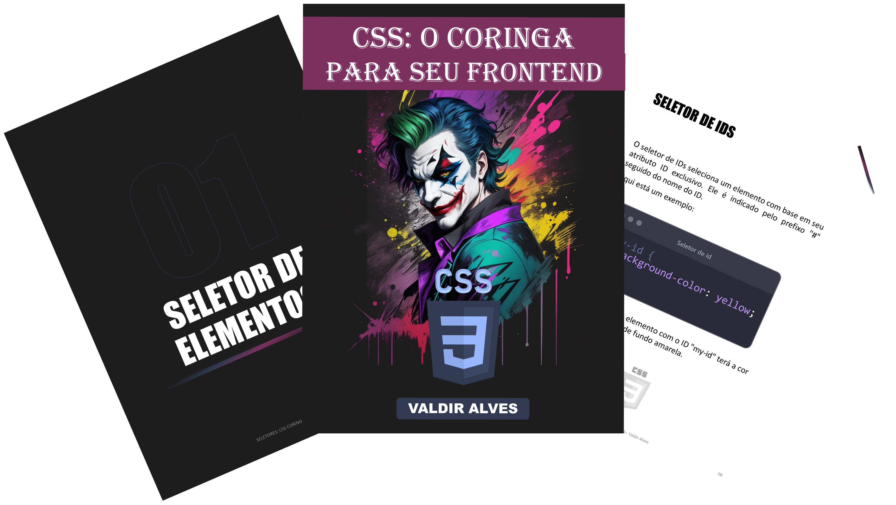

    

---

# Projeto EBOOK Gerado por I.A.s

> ℹ️ **NOTE:** Este é o repositório foi desenvolvido durante o curso ministrado pelo instrutor técnico [Felipe Aguiar](https://www.linkedin.com/in/felipe-exe/) na plataforma da [DIO](https://www.dio.me/sign-up?ref=WXSFIF1TPZ).

Projeto com o objetivo de gerar um ebook digital com as facilidades das ferramentas de IA. todos os prompts
seguem abaixo.

<a href="https://github.com/valdir-alves3000/prompts-recipe-to-create-a-ebook/blob/main/output/ebook-css-o-coringa.pdf" title="View PDF now"> 📕Clique aqui para ler</a>

## 💻 Tecnologias utilizadas no projeto

- [ChatGPT](https://chat.openai.com/) - para título e conteúdo
- [Leonardo.ai](https://leonardo.ai/) - para gerar imagens
- [Lexica.art](https://lexica.art/) - para gerar imagens
- [PowerPoint](https://www.microsoft.com/en/microsoft-365/powerpoint) - Para formatação de banners e Layouts
- [Paint 3D](https://apps.microsoft.com/store/detail/paint-3d/9NBLGGH5FV99?hl=pt-br&gl=br) - Para formatação de banners e Layouts

## 🧠 Prompts

ChatGPT：

|   Ação   | prompt                                                                                                                                                                                                                                                                    |
| :------: | ------------------------------------------------------------------------------------------------------------------------------------------------------------------------------------------------------------------------------------------------------------------------- |
|  título  | Crie um título de um ebook sobre o tema de css, o ebook é do nicho de programação e o subnicho é de css, o título deve ser épico e curto, e tenha uma temática matemática no título, me liste 5 variações de títulos                                                      |
| conteúdo | Faça um texto para ebook, com foco em css, listando os principais seletores, com exemplo de código {REGRAS} explique sempre de uma maneira simples, deixe o texto enxuto, sempre traga exemplos de código em contextos reais, sempre deixe um título sugestivo por tópico |

Leonardo:

- No Leonardo utilizamos o acervo público de imagens geradas por outras pessoas, não foi necessário nenhum termo especial para pesquisa.

## ✨ Features

- Conteúdo gerado via ChatGPT
- Imagens geradas via Leonardo

## 📚 Materiais

- Imagens utilizadas em `.github/assets`
- ebook gerado durante as aulas em `output`

## 🛠️ Instruções de execução

Utilize os prompts acima nas ferramentas sugeridas para gerar o material base e utilize uma ferramenta de edição de documentos e imagens, como powerpoint e paint 3D. Além de poder seguir o passo a passo em vídeo dentro da plataforma da [DIO](https://dio.me).

## 👨‍💻 Autor

  
  
&nbsp&nbsp&nbspValdir Alves 
    &nbsp&nbsp&nbsp
    <a href="https://github.com/valdir-alves3000">
    GitHub</a>&nbsp;|&nbsp;
    <a href="https://www.linkedin.com/in/valdiralves3000">LinkedIn</a>
    

  

---
